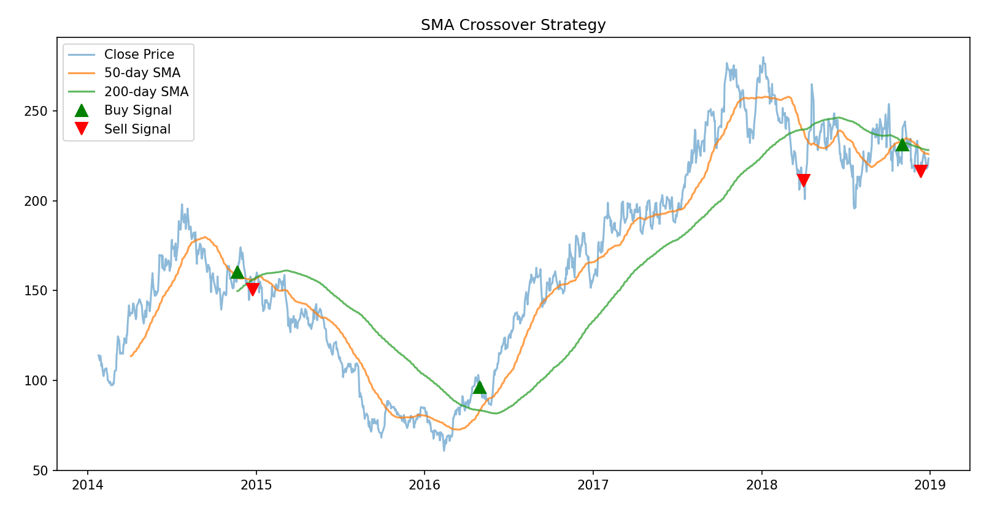
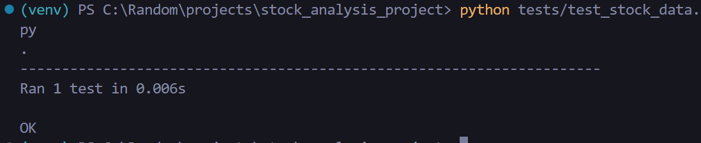

# Stock Market Analysis

## Overview of Project

The purpose of this project is to analyze the stock market data for the years 2017 and 2018 to help the client make an informed decision on which stocks to invest in. The analysis will be done using SMA to determine the best stocks to invest in based on the volume of stocks traded and the return on investment.

## Results

### SMA Analysis Screenshot

### Testing using unittest

The testing was done using the `unittest` module in Python. The test was done to ensure that the `SMA` function returns the correct values for the stock data. The test was successful as all the test cases passed.

## Summary

This was a successful analysis of the stock market data for the years 2017 and 2018. The analysis was done using the SMA function to determine the best stocks to invest in based on the volume of stocks traded and the return on investment. The analysis was successful as the client was able to make an informed decision on which stocks to invest in.